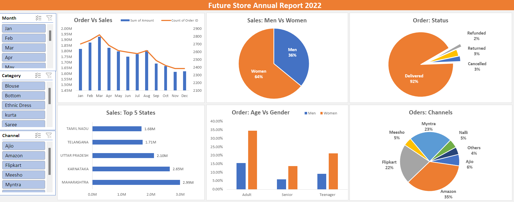

# Project: Future Store Annual Report 2022

## Project Objective
Future store Want to create an annual sales report for 2022. So that, future store can understand their customer and grow more sales in 2023.

## Data Sources
The data for the Future Store Annual Report 2022 project originates from excel file
#### Future store data Table:
  - Index, order id, customer id, gender, age, age group, date, month, status, channel, sqategory, size, Qty, currency, amount, Ship-city, ship-state, ship-postal-code, ship-country, B2B.

## Methodology
- **Data Cleaning**: Ensure data integrity by handling identify dataissues, and inconsistencies.
- **Data Transformation**: Perform necessary transformations such as aggregations, calculations, and formatting to prepare the data for visualization.
- **Dashboard Design**: Design the layout and components of the dashboard, including charts, tables, and filters.
- **Dashboard Development**: Implement the dashboard using a suitable tool like pivot table and charts.
- **Testing and Validation**: Verify the accuracy and functionality of the dashboard by conducting thorough testing.
- **Deployment**: Deploy the dashboard to a suitable platform for access by stakeholders.

## Steps to Create the Dashboard
- **Define Requirements**: Gather requirements from stakeholders to understand their needs and expectations.
- **Data Exploration**: Explore the data to gain insights and identify key metrics for the dashboard.
- **Dashboard Planning**: Plan the layout, visualizations, and interactivity of the dashboard based on the identified metrics.
- **Dashboard Creation**: Develop the dashboard using selected tools and techniques, incorporating the necessary visualizations and functionalities.
- **Finalization**: Finalize the dashboard design and ensure that it meets the project objectives and stakeholder requirements.
- **Documentation**: Document the dashboard design, data sources, methodologies, and key findings for future reference.

## Key Findings
  - Woomen are more likely to buy compared to men (65%)
  - Maharashtra, Karnataka and Uttar Pradesh are the top 3 state (35%) 
  - Adult age group (30-49 yrs) in maximum contribution (50%)
  - Amazon, flipkart and Myntra Channel are maximum contributing (80%)
#### Final conclusion to improve future store sales:
  - Target women customers of age group (30-49 yrs) living in Maharashtra, Karnataka and Uttar Pradesh by showing ads/offer/coupons available on Amazon, Flipkart and Myntra.

## Project Deliverables
- Final Dashboard 
